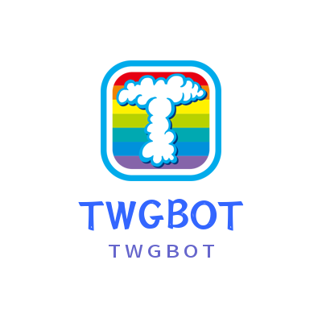

 
项目编写于2020年8月12日
该项目以<a href="https://gitee.com/y_project/RuoYi-Vue" target="_blank">若依框架</a>为基础开发 
使用 <a href="https://github.com/MisakaTAT/Shiro" target="_blank">Shiro</a> OneBot协议的QQ机器人快速开发框架

> 使用方法： 
安装**Java JDK 1.8**  
安装**MySql 8.5+**  
安装**Redis 5.0+**  
新建一个名为 **bot-server** 的数据库 编码为 **utf-8mb4** 排序规则为 **utf8mb4_0900_ai_ci** 
> 导入 **sql/bot-server.sql** 文件 **到你新建的数据库中**

> 修改 **twg-admin/src/main/resources** 中的 **application-druid.yml**  
> 主库数据源 下的 **master**  
**username: 你的MySql用户名** 
**password: 你的MySql密码**

> 修改 **src/main/java/com/twg/bot/enums/WarframeTypeEnum** 中的 **ADMIN_QQ(你的QQ账号)**  

### Bot-Aiml

    关键词回复模块
    --------------------------------
    主要实现了模糊关键词回复
    支持教学与回复,表情|艾特|图片|GIF图片

---------------

### Bot-Group

    群组控制模块
    ---
    入群验证码功能

---

### Bot-Image-ToGif

> ### Gif表情包生成模块
> #### 在指令后方@某个群员 如果没有@默认时你自己的头像
> **指令：** 
> capoo  
> funnny 
> 精神支柱 
---

### Bot-Server

    Bot核心模块

---

### Bot-Warframe

> ### Warframe 游戏查询模块
> 使用此模块时需要先开启功能，管理人员发送 **开启WF** 即可开启功能
>   同理，发送 **关闭WF** 即可关闭功能

> 指令： 
> **突击** 
> **入侵** 
> **奸商** 
> **仲裁** 
> **每日特惠** 
> **裂隙** 
> **平原** 
> **钢铁** 
> **电波** 
> **翻译** 
> **紫卡倾向变动** 

> 查询指令用法介绍  
> **/WM** 从 <a href="https://warframe.market/" target="_blank">Warframe.Market</a> 上查询物品的售价 
> 例如： /wm 充沛 满级、/wm ash、/wm 牛、/wm 压迫点 满级 买家   
> **/WiKI** 拼接 <a href="https://warframe.huijiwiki.com/">灰机Wiki</a> 的搜索链接   
> **/WR** | **/ZKWM** 从 <a href="https://warframe.market/" target="_blank">Warframe.Market</a> 上查询紫卡的售价 
> 例如： /wr 绝路、/wr 拉托 -爆率,多重 -有|无   
> **/CD** | **/C** 从 <a href="https://warframe.market/" target="_blank">Warframe.Market</a> 上查询赤毒武器的售价 
> 例如：/CD 沙皇、/C 沙皇   
> **/XT** | **/X** 从 <a href="https://warframe.market/" target="_blank">Warframe.Market</a> 上查询信条武器的售价 
> 例如：/XT 弧电、 /X 弧电

> 订阅指令 
> 使用订阅指令之前请发送 订阅列表查看对应的订阅内容 
> **订阅/取消订阅** 
> 此指令用于群订阅 
在订阅指令后方加上 订阅列表中的数字 
管理员/群主 可强制取消 订阅 
如： 订阅 2 
意为 ：订阅仲裁 
取消订阅 2 
意为 ： 取消订阅仲裁
>   
> **私人订阅 / 取消私人订阅**
> 此指令用于私人订阅  与订阅指令不同之处 你订阅的某个内容更新时 机器人会主动@你

> 交流群：260079469

相关文档：<a href="https://www.yuque.com/kingprimes/twgbot" target="_blank">语雀</a> 
如果对你有帮助还请支持一下作者<a href="https://afdian.net/@KingPrimes" target="_blank">爱发电</a>

Thanks
---
Thanks <a href="https://www.jetbrains.com/?from=TWGBot" rel="nofollow" target="_blank">JetBrains</a> Provide Free
License Support OpenSource Project

